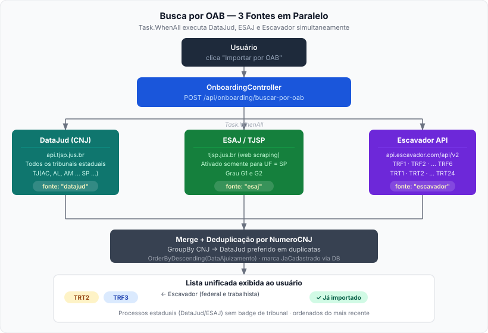
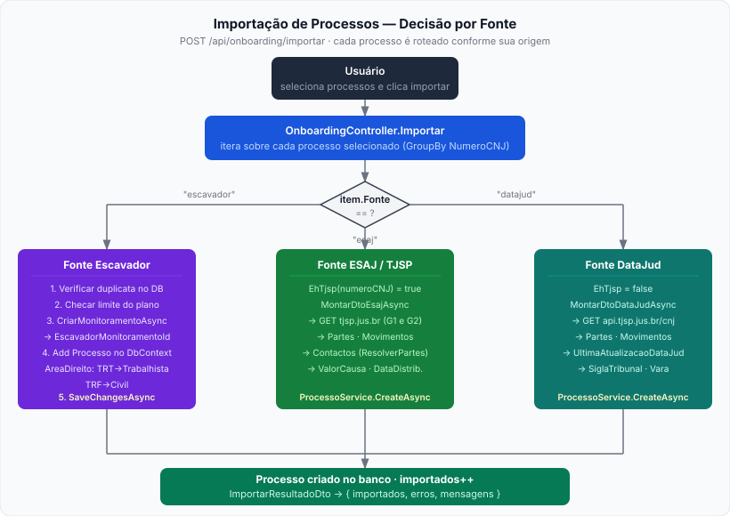
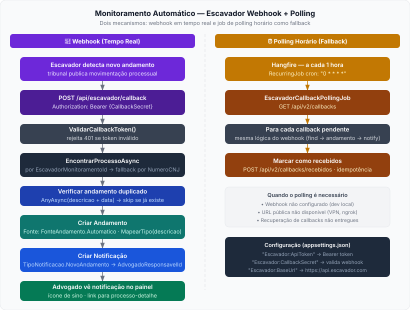

# Fontes de Dados — Importação e Monitoramento de Processos

A plataforma integra três fontes distintas para cobrir toda a Justiça brasileira: DataJud (CNJ), ESAJ/TJSP e Escavador. A busca e a importação são transparentes ao usuário — o fluxo é unificado a partir do botão **Importar por OAB**.

---

## 1. Visão Geral das Fontes

| Fonte | Cobertura | Mecanismo | Monitoramento |
|---|---|---|---|
| **DataJud (CNJ)** | Todos os TJs estaduais | API REST pública (CNJ) | Via polling DataJud |
| **ESAJ / TJSP** | Somente TJSP (SP) | Web scraping (G1/G2) | Via polling DataJud |
| **Escavador** | TRF1-6 · TRT1-24 | API REST v2 (Bearer token) | Via webhook push (tempo real) |

### Identificação pelo NumeroCNJ

O campo `J` (posição 14 da string normalizada) indica a Justiça:

- `J = 8` → Estadual (TJ) — coberto por DataJud/ESAJ
- `J = 4` → Federal (TRF) — coberto por Escavador
- `J = 5` → Trabalhista (TRT) — coberto por Escavador

---

## 2. Fluxo de Busca por OAB

Ao clicar em **Importar por OAB** e informar o número OAB + UF, o backend dispara **três buscas em paralelo** com `Task.WhenAll`:



### Detalhes por fonte

#### DataJud
- Endpoint: `GET https://api.tjsp.jus.br/cni/v1/advogado-processo?oab={n}&uf={uf}`
- Retorna processos de qualquer TJ do Brasil associados àquela OAB
- Resultado mapeado para `ProcessoOabPreviewDto` com `Fonte = "datajud"`

#### ESAJ / TJSP
- Ativado **somente** quando a UF informada é `SP`
- Web scraping autenticado do portal eSAJ (graus G1 e G2)
- Retorna dados mais ricos: partes, movimentos, valor da causa, distribuição
- Resultado mapeado para `ProcessoOabPreviewDto` com `Fonte = "esaj"`

#### Escavador
- Endpoint: `GET https://api.escavador.com/api/v2/advogado/{oab}/processos?uf={uf}&page={p}`
- Paginação de até **2 páginas** (~50 resultados) — suficiente para buscas por OAB
- Filtrado para apenas **TRF** e **TRT** (federal e trabalhista)
- Resultado mapeado para `ProcessoOabPreviewDto` com `Fonte = "escavador"`

### Deduplicação e ordenação

```
tarefaDataJud.Result
  .Concat(tarefaEsaj.Result)
  .Concat(tarefaEscavador.Result)
  .GroupBy(p => p.NumeroCNJ)
  .Select(g => g.First())           // DataJud/ESAJ preferidos (primeiro na concat)
  .OrderByDescending(p => p.DataAjuizamento)
```

O mesmo CNJ nunca aparece duas vezes. Se DataJud e Escavador retornam o mesmo processo, o registro DataJud é preferido (dados mais completos).

### Badges na interface

| Badge | Cor | Significado |
|---|---|---|
| `TRT2` amarelo | `#fef3c7 / #92400e` | Tribunal Regional do Trabalho |
| `TRF3` azul | `#dbeafe / #1e40af` | Tribunal Regional Federal |
| `✓ Já importado` verde | `#d1fae5 / #065f46` | Já existe no banco deste tenant |
| *(sem badge)* | — | Processo estadual (DataJud/ESAJ) |

---

## 3. Fluxo de Importação

Ao selecionar processos e clicar em **Importar Selecionados**, cada item é roteado conforme sua origem:



### Roteamento por `Fonte`

#### `fonte = "escavador"` — Processo Federal ou Trabalhista
1. Verifica duplicata no banco (`AnyAsync NumeroCNJ + TenantId`)
2. Consulta limite do plano: `PlanoRestricoes.MaxProcessosMonitorados(tenant.Plano)`
3. Se abaixo do limite: `_escavador.CriarMonitoramentoAsync(cnj)` → salva `EscavadorMonitoramentoId`
4. Cria `Processo` diretamente no `DbContext` (sem `ProcessoService`) para definir `EscavadorMonitoramentoId`, `Monitorado`, `SiglaTribunal`, `AreaDireito`
5. `SaveChangesAsync`

```
AreaDireito inferida:
  SiglaTribunal.StartsWith("TRT") → Trabalhista
  SiglaTribunal.StartsWith("TRF") → Civil
  outro                           → Outro
```

#### `fonte = "esaj"` — TJSP
1. `MontarDtoEsajAsync` → busca detalhes nos graus G1 e G2 no portal TJSP
2. Resolve partes → cria/busca contatos no banco
3. `ProcessoService.CreateAsync(dto)` → salva processo + andamentos + partes

#### `fonte = "datajud"` (padrão)
1. `MontarDtoDataJudAsync` → `GET api.tjsp.jus.br/cnj/{numero}`
2. Resolve partes → cria/busca contatos no banco
3. `ProcessoService.CreateAsync(dto)` → salva processo + andamentos + partes

---

## 4. Monitoramento Automático (Escavador)

Processos importados via Escavador são monitorados por push webhook, sem polling periódico dos tribunais:



### Webhook (tempo real)

**Endpoint:** `POST /api/escavador/callback`  
**Auth:** `Authorization: Bearer {Escavador:CallbackSecret}` (validado via `ValidarCallbackToken`)

Payload recebido:
```json
{
  "tipo": "novo_andamento",
  "monitoramentoId": 12345,
  "processo": { "numero": "1234567-89.2023.4.03.6100" },
  "conteudo": { "descricao": "Despacho — Cite-se.", "data": "2024-03-15" }
}
```

Processamento:
1. Localiza `Processo` pelo `EscavadorMonitoramentoId` (fallback: `NumeroCNJ`)
2. Verifica duplicata: `AnyAsync(descricao + data)`
3. Cria `Andamento` com `Fonte = FonteAndamento.Automatico`
4. Mapeia tipo: despacho / decisão / sentença / acórdão / audiência / intimação / publicação / petição / outro
5. Cria `Notificacao` (tipo `NovoAndamento`) para o `AdvogadoResponsavelId`

### Polling horário (fallback)

`EscavadorCallbackPollingJob` roda a cada hora via Hangfire (`"0 * * * *"`):

- `GET /api/v2/callbacks` → lista callbacks não consumidos
- Processa cada um com a mesma lógica do webhook
- `POST /api/v2/callbacks/recebidos` → marca como recebidos (idempotência)

**Necessário quando:**
- URL pública não está configurada no dashboard do Escavador
- Ambiente de desenvolvimento local (sem ngrok ou similar)
- Recuperação de callbacks que não foram entregues

---

## 5. Configuração

Defina as variáveis no arquivo `.env` (copie de `.env.example`):

```env
ESCAVADOR_API_TOKEN=seu-token-aqui
ESCAVADOR_CALLBACK_SECRET=string-aleatoria-para-validar-webhook
```

Gere o `CallbackSecret` com:
```sh
openssl rand -base64 32
```

Essas variáveis são injetadas via `docker-compose.yml` como:
```
Escavador__ApiToken       → appsettings: Escavador:ApiToken
Escavador__CallbackSecret → appsettings: Escavador:CallbackSecret
```

A URL de callback deve ser configurada no dashboard do Escavador:
```
https://sua-instancia.causify.com.br/api/escavador/callback
```

---

## 6. Arquivos Relevantes

| Arquivo | Responsabilidade |
|---|---|
| `API/Controllers/OnboardingController.cs` | Busca (3 fontes paralelas) e importação com roteamento por fonte |
| `API/Controllers/EscavadorController.cs` | Endpoint webhook `/api/escavador/callback` |
| `Application/Interfaces/IEscavadorService.cs` | Interface + DTOs da API Escavador |
| `Infrastructure/Escavador/EscavadorHttpClient.cs` | Implementação HTTP da API Escavador v2 |
| `Infrastructure/Jobs/EscavadorCallbackPollingJob.cs` | Job Hangfire de polling horário |
| `Domain/Entities/Processo.cs` | Campo `EscavadorMonitoramentoId` para lookup no webhook |
| `wwwroot/js/onboarding.js` | Modal OAB: busca, renderização com badges, serialização por fonte |
